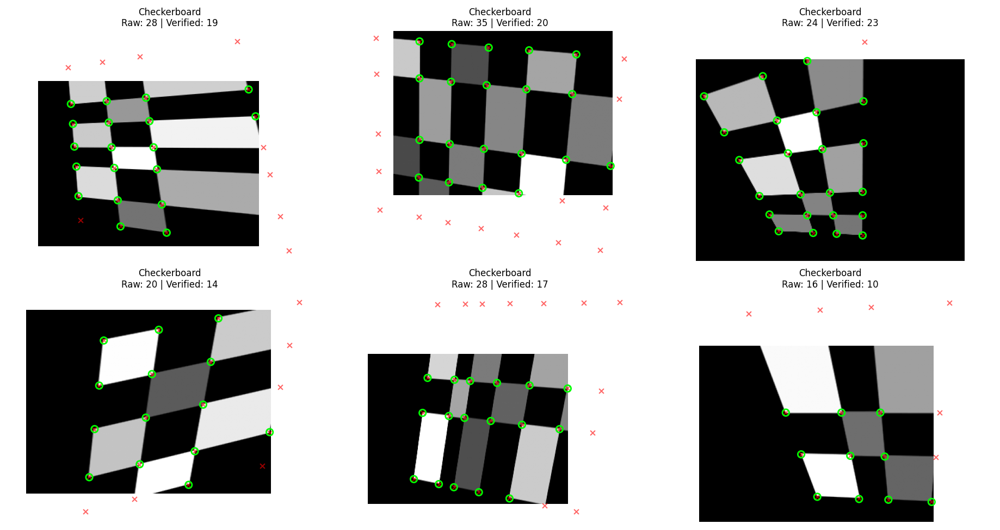
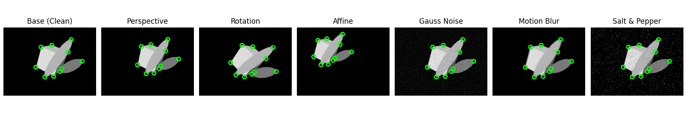
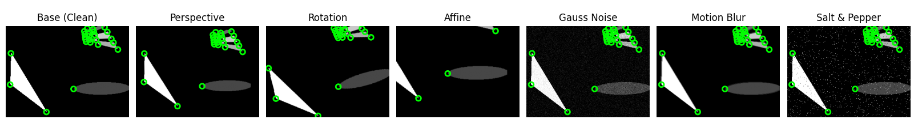
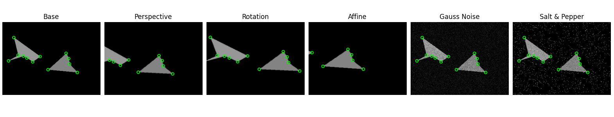
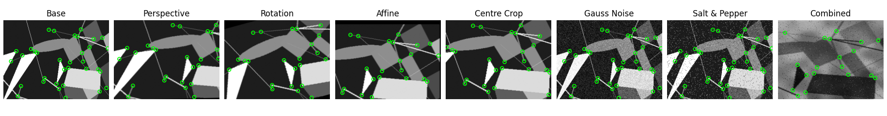
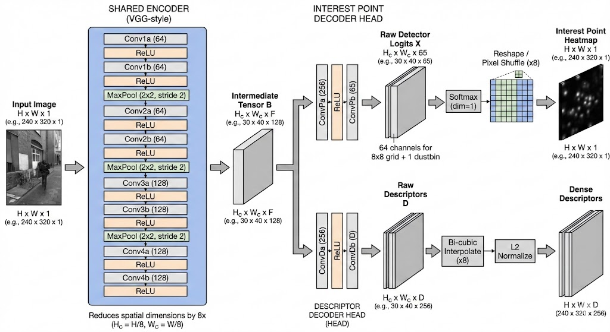

# Setup 
```
# 1. Clone the repository
git clone git@github.com:shashankyld/superpoint_pytorch.git
cd superpoint_pytorch

# 2. Sync the environment (Creates .venv and installs all dependencies from uv.lock)
uv sync

# 3. Verify the installation
uv run python -c "import torch; print(f'CUDA Available: {torch.cuda.is_available()}')"
```

## Dev tools
```
# Check for errors
uv run ruff check .

# Formats the codebase
uv run ruff format .
```

## Requirements
```
(tested on)
1. python == 3.13
2. pytorch == 2.1.1
3. torchvision == 0.16.1

```

## Notes
```
# 1. I just have notebooks folder to verify all the classes that I create of the model, dataset, evaluation metrics.

```

## Implementation details 

Step 1: Train Magic Point on Synthetic Dataset
#### Image of synthetic dataset created using cubes - shapes.py

#### Image of synthetic dataset created using checkerboards - shapes.py

#### Sample of Data Augmentations used in Synthetic Dataset
```
One thing that I think I will avoid is to set keypoints at intersections that exist in 2D because of overlapping shapes but really they are not stable points to track. Imagine as the camera moves, the intersection keeps changing in the 2D space in the case shown below:
```

#### Notes on problems with geomtric augmentations
```
Sometimes, geometric augmentations can create artificial corners when the regions outside the boundary enter the image frame after the transformation as shown below. Look at the perspective and affine sections where ellipse now has two more corners that are missed out in the ground truth keypoints. 

I want to have perfect ground truth keypoints and hence, I will add cropping after geometric augmentations to avoid such cases. This ensures diversity that comes from perspective distortions without post-processing issues for new keypoint search.
```


```
I for now just implemented cropping after geometric augmentations just to avoid the above issue. In future, I can think of more robust ways to handle this.
```


#### Final Setup for Synthetic Dataset Augmentations
    

## Model Architecture
